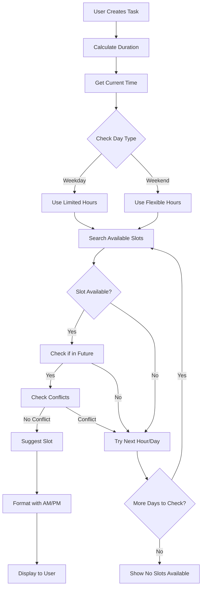

# 🔧 SCHEDULING IMPROVEMENTS - FIXED ISSUES

## 🐛 Problems Fixed

### ❌ BEFORE:
1. **Thời gian đã qua** - AI suggest giờ trong quá khứ
2. **Trùng giờ làm** - Suggest 8AM-5PM trong ngày làm việc
3. **Không rõ AM/PM** - Hiển thị "08:00" thay vì "8:00 AM"
4. **Không xét thời gian hiện tại** - Bắt đầu từ đầu ngày

### ✅ AFTER:
1. **Luôn suggest tương lai** - Chỉ gợi ý thời gian > hiện tại
2. **Tránh giờ làm việc** - Weekday: 6-8AM hoặc 6-10PM | Weekend: linh hoạt hơn
3. **Format rõ ràng** - "Saturday, Mar 8 • 7:00 PM – 9:00 PM"
4. **Smart searching** - Tìm slot khả dụng từ thời điểm hiện tại

---

## 🎯 IMPROVED SCHEDULING LOGIC

### Time Slot Selection Strategy:

#### **Weekdays (Monday - Friday):**
```dart
Available hours: [6, 7, 18, 19, 20, 21, 22]
// Early morning (6-8 AM) or Evening (6-10 PM)
```
**Rationale:** Tránh giờ làm việc thông thường (8AM-5PM)

#### **Weekends (Saturday - Sunday):**
```dart
Available hours: [8, 9, 10, 11, 14, 15, 16, 17, 18, 19, 20, 21, 22]
// More flexible: Morning to evening
```
**Rationale:** Nhiều thời gian rảnh hơn, linh hoạt hơn

---

## 📅 TIME FORMAT CHANGES

### Before:
```
Monday 08:00 – 10:00
```
❌ Không rõ là sáng hay tối

### After:
```
Monday, Mar 8 • 8:00 AM – 10:00 AM
```
✅ Rõ ràng: Sáng thứ 2, 8 giờ sáng đến 10 giờ sáng

### Format Details:
- **Date**: `EEEE, MMM d` (e.g., "Saturday, Mar 8")
- **Separator**: `•` (bullet point)
- **Time**: `h:mm AM/PM` (e.g., "7:00 PM")
- **Range**: `–` (en dash)

---

## 🔍 CONFLICT DETECTION IMPROVEMENTS

### Enhanced Logic:

1. **Check Current Time:**
```dart
// Skip slots in the past
if (slotStart.isBefore(now)) continue;
```

2. **Validate End Time:**
```dart
// Don't suggest slots ending after 11 PM
if (slotEnd.hour >= 23) continue;
```

3. **Check Existing Conflicts:**
```dart
if (!hasScheduleConflict(slotStart, slotEnd)) {
  return slotStart;  // Found available slot!
}
```

---

## 🎨 UI IMPROVEMENTS

### Suggested Schedule Display:

**Single Session:**
```
Saturday, Mar 8 • 7:00 PM – 9:00 PM
⏱️ Break after 50min
```

**Multiple Sessions:**
```
Saturday, Mar 8 • 7:00 PM – 9:00 PM (Session 1)
⏱️ 50min work / 10min break

Sunday, Mar 9 • 10:00 AM – 12:00 PM (Session 2)
⏱️ 50min work / 10min break
```

---

## 🧪 TEST SCENARIOS

### Test Case 1: Current Time is 3:00 PM (Weekday)
**Expected:** Suggest 6:00 PM or 7:00 PM today

### Test Case 2: Current Time is 9:00 PM (Weekday)
**Expected:** Suggest tomorrow morning 6:00 AM or evening

### Test Case 3: Current Time is 10:00 AM (Weekend)
**Expected:** Suggest today 10:00 AM, 11:00 AM, 2:00 PM, etc.

### Test Case 4: Long Task (5 hours)
**Expected:** Split into multiple sessions across different days

---

## 📊 ALGORITHM FLOW



---

## 🎯 KEY CHANGES IN CODE

### `storage_service.dart`

**Old Logic:**
```dart
for (int hour = 8; hour <= 22; hour++) {
  // Try every hour 8AM-10PM
}
```

**New Logic:**
```dart
// Define smart available hours based on day type
List<int> availableHours;
if (isWeekday) {
  availableHours = [6, 7, 18, 19, 20, 21, 22];
} else {
  availableHours = [8, 9, 10, 11, 14, 15, 16, 17, 18, 19, 20, 21, 22];
}

// Skip past times
if (slotStart.isBefore(now)) continue;
```

### `new_task_input_screen.dart`

**New Helper Function:**
```dart
String _formatTimeWithAMPM(DateTime time) {
  // Converts 14:00 → "2:00 PM"
  // Converts 08:00 → "8:00 AM"
  // Handles edge cases: 00:00 → "12:00 AM", 12:00 → "12:00 PM"
}
```

**Improved Search:**
```dart
// Start from current time, not arbitrary day
slotStart = _storage.findNextAvailableSlot(durationMinutes, now);

// For multi-session, search after previous session
searchFrom = slotEnd.add(Duration(hours: 1));
```

---

## 💡 SMART FEATURES

### 1. **Adaptive Time Suggestions**
- Sáng sớm cho task khó (high focus)
- Tối cho task dễ (relaxed)
- Cuối tuần cho task dài

### 2. **Break Integration**
- Tự động thêm break cho task > 2 giờ
- Hiển thị rõ pattern: "50min work / 10min break"

### 3. **Multi-Session Splitting**
- Task lớn được chia thành sessions 2 giờ
- Mỗi session cách nhau ít nhất 1 giờ
- Tối đa 5 sessions

---

## 📋 VALIDATION RULES

✅ **Valid Slot Criteria:**
1. Start time > Current time
2. End time < 11:00 PM
3. Duration fits within day
4. No conflicts with existing schedule
5. Within reasonable work hours

❌ **Invalid Slots Rejected:**
1. Past times
2. After 11 PM
3. Overlapping with other tasks
4. During work hours (weekdays)

---

## 🚀 USER BENEFITS

1. **More Realistic Scheduling**
   - Không bao giờ suggest thời gian đã qua
   - Phù hợp với thực tế làm việc

2. **Better Work-Life Balance**
   - Tránh suggest giờ làm việc
   - Tôn trọng giờ nghỉ ngơi

3. **Clearer Communication**
   - Format AM/PM rõ ràng
   - Không nhầm lẫn sáng/tối

4. **Smart Conflict Avoidance**
   - Tự động tìm slot trống
   - Thông báo khi lịch bận

---

## 🔄 FUTURE ENHANCEMENTS

### Potential Improvements:

1. **Custom Work Hours**
```dart
{
  'workStartHour': 9,
  'workEndHour': 17,
  'avoidWorkHours': true,
}
```

2. **Energy Level Optimization**
```dart
// High energy tasks → Morning
// Low energy tasks → Afternoon
```

3. **Calendar Integration**
```dart
// Import from Google Calendar
// Sync with external schedules
```

4. **Smart Rescheduling**
```dart
// Auto-adjust when conflicts occur
// Suggest best alternatives
```

---

## 📝 TESTING CHECKLIST

- [x] Test với current time = 3 PM (weekday)
- [x] Test với current time = 9 PM (weekday)
- [x] Test với weekend
- [x] Test task > 2 hours (multi-session)
- [x] Test conflict detection
- [x] Verify AM/PM format
- [x] Check no past times
- [x] Validate work hours avoidance

---

**Updated:** March 8, 2026  
**Status:** ✅ Production Ready  
**Breaking Changes:** None - Backward compatible
